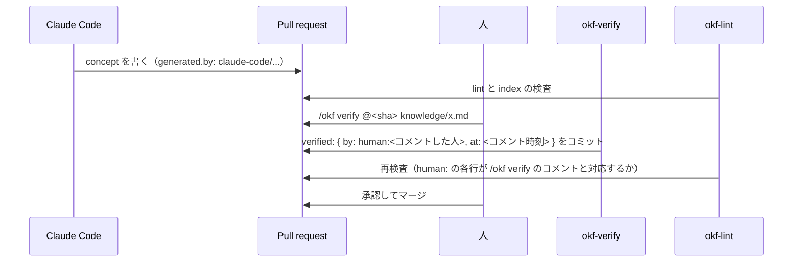

# okf-knowledge

[English](README.md) | 日本語

チームの知識を [Open Knowledge Format (OKF) v0.2](https://github.com/GoogleCloudPlatform/open-knowledge-format/blob/main/SPEC.md) の bundle としてリポジトリに置き、エージェントが書き、人が確認し、CI が検査する。
そのための Claude Code プラグインです。

OKF は、知識を YAML frontmatter 付きの Markdown ファイルとして保存します。
v0.2 では、frontmatter に次の 4 つが加わりました。

- **`generated`**：誰が書いたか
- **`verified`**：誰が確認したか
- **`status`**：現役か
- **`stale_after`**：いつ期限切れになるか

このプラグインは、これらのフィールドが書いてあるとおりの意味を持つようにします。

- **エージェントが書き、人が確認する。**
  Claude Code は `generated` に自分を記録し、`verified` に `human:` の行を書きません。
  人は PR に `/okf verify @<sha> <path>` とコメントして確認し、ワークフローがそれを記録します。
  CI は、書き込み権限を持つ人のそうしたコメントと対応しない `human:` の行を落とします。
- **仕様が決めていない点を、チームの規約で決める。**
  OKF v0.2 は、相対パスの基準と actor の書式を決めていません。
  また、日付だけの `stale_after` は、何も警告されないまま期限切れになりません。
  `CONVENTIONS.md` でこれらを決め、lint で守らせます。
- **知識の期限切れを定期的に洗い出す。**
  週に一度、期限切れ、廃止、未確認、確認後に変更された concept を一覧にした Issue を作ります。

## インストール

```sh
claude plugin marketplace add kumewata/okf-knowledge
claude plugin install okf-knowledge@okf-knowledge
```

スクリプトの実行には [uv](https://docs.astral.sh/uv/) と Python 3.11 以上が必要です。
依存パッケージ（PyYAML）は各スクリプトの中で宣言しているので、ほかにインストールするものはありません。

## リポジトリの準備

Claude Code に「OKF の knowledge bundle をセットアップして」と頼むか、次の手順で準備します。

1. [`templates/CONVENTIONS.md`](skills/okf-knowledge/templates/CONVENTIONS.md) を `knowledge/CONVENTIONS.md` にコピーし、チームで内容を決める。
2. frontmatter に `okf_version: "0.2"` を書いた `knowledge/index.md` を作り、残りの index を [`scripts/index.py`](skills/okf-knowledge/scripts/index.py) で生成する（`uv run index.py knowledge`）。
3. [`templates/github/`](skills/okf-knowledge/templates/github/) の 3 つのワークフローを `.github/workflows/` にコピーし、`okf-lint` を必須チェックにする。

`knowledge/` は既定の名前にすぎず、bundle は任意のディレクトリに置けます。
その場合は、ワークフローの `paths` と `bundle` を合わせて変えてください。
1 つのリポジトリに複数の bundle を置くこともでき、bundle ごとに `CONVENTIONS.md` を持ちます。
このときは、各ワークフローに bundle ごとの job を足します。
okf-lint の `paths` はワークフロー全体の絞り込みなので、すべての bundle のディレクトリを並べます。
okf-status の job には、それぞれ別の `label` を付けます。
`/okf verify` のコメントには、1 つの bundle のパスだけを書いてください。

コピーしたワークフローは、このリポジトリの再利用ワークフローを呼びます。
再利用ワークフローはスクリプトを自分と同じコミットで checkout するので、`@v1.0.5` と指定すれば両方が固定されます。
リリースタグ（`v1.0.0`、`v1.0.1` など）は一度付けたら動かさず、修正は新しいタグで出します。
`v1` タグは使わないでください。既知の不具合があるリリース前のコミットを指しています。

## 既定ブランチの保護

lint が検査するのは PR で追加された差分なので、守れるのは PR を通って既定ブランチに入る変更だけです。
既定ブランチに、ブランチ保護ルールか ruleset を設定してください。

- **マージ前に PR を必須にする。**
  `human:` の行や規約の変更が、PR を通らずに直接 push されるのを防ぎます。
- **ステータスチェックの成功を必須にし、okf-lint の各 job を指定する。**
  チェック名は `<呼び出し側の job 名> / lint` で、たとえば `okf-lint / lint` です（2 つ目の bundle があれば `okf-lint-ops / lint` なども）。
- **Code Owners のレビューを必須にし、各 bundle の規約とワークフローを `CODEOWNERS` に登録する。**
  lint と verify が従う規則を、オーナーの承認なしに変えられないようにします。

  ```
  /knowledge/CONVENTIONS.md @your-org/knowledge-owners
  /.github/workflows/ @your-org/knowledge-owners
  ```

  `pull_request` のワークフローは PR 側の定義で動きます。
  そのため、これがないと PR が自分の okf-lint の呼び出しを書き換えて（たとえば `bundle` を別の場所に向けて）、必須チェックを通せてしまいます。
  organization では、ステータスチェックではなく okf-lint のワークフロー自体を ruleset で必須にする方法もあります。
  詳しくは、ruleset でワークフローを必須にする方法についての GitHub の文書を参照してください。

okf-lint を必須にして GitHub App を使わない場合、`/okf verify` のたびに、bot のコミットに対する lint の実行をメンテナーが承認する必要があります（後述）。

## 確認の流れ



確認の合図に PR の承認（approve）は使いません。
GitHub では作成者が自分の PR を承認できず、しかも Claude Code を操作した作成者こそが、その出力を一番よく確かめられる立場にあることが多いからです。

`okf-verify` は次のコメントを拒否します。

- 書き込み権限を持たない人のコメント
- PR の head ではない SHA を指定したコメント（コメントの後に push された、誰も見ていない内容を検証済みにしないため）
- PR が変更していないファイルを指定したコメント
- `allow_self_verify` が false のとき、PR を作った人とコミットした人のコメント

fork からの PR には、まだ対応していません。

lint と verify のワークフローは、どちらも `CONVENTIONS.md` を base ブランチから読みます。
そのため、PR が自分自身の規約を緩めることはできません。
lint は、追加された `human:` の行を、git の作成者名ではなく PR のコメントと突き合わせます。
作成者名は誰でも自由に設定できるからです。
verify の job は書き込み権限のトークンを持つので、PR のコードを一切実行しません。
スクリプトと PR を別々のディレクトリに checkout し、uv にはプロジェクトの設定を読ませません。
実行する外部のコードは PyYAML だけで、バージョンを 1 つに固定し、ハッシュを検査するロックファイル（`scripts/*.py.lock`）からインストールします。

GitHub App を使わない場合、`okf-verify` は `GITHUB_TOKEN` で push します。
このとき GitHub は、そのコミットに対する lint の再実行を、メンテナーが承認するまで保留します。
保留を避けるには、`contents: write` と `pull-requests: write` を持つ GitHub App をインストールし、その ID と秘密鍵を secrets の `OKF_APP_ID` と `OKF_APP_PRIVATE_KEY` に登録してください（雛形を参照）。

## スクリプト

| スクリプト | 役割 |
| --- | --- |
| `lint.py <bundle> [--base <ref>] [--format text\|github]` | 仕様への適合とチームの規約を検査する（OKF001〜OKF012） |
| `index.py <bundle> [--check]` | `index.md` を生成する、または古さを検出する（§8） |
| `status.py <bundle> [--now <iso>] [--format md\|json] [--link-prefix <url>]` | 対応が必要な concept を一覧にする（規約ファイルは含めない） |
| `verify.py <bundle> <path>... --by human:<id> --at <iso>` | 確認の記録を追記する（ワークフローが使う） |

lint の各ルールと `okf_conventions` の全キーは、[`references/conventions-schema.md`](skills/okf-knowledge/references/conventions-schema.md) にあります。

## 対象外

- Attested Computation（OKF §10）。
  receipt と verdict の形式、attester のインターフェースを、仕様が将来の版に回しているためです。
- Claude Code 以外のエージェント。
- GitHub Enterprise Server。
  再利用ワークフローが `job.workflow_repository` と `job.workflow_sha` を使いますが、GitHub Enterprise Server はこれらを提供していません。

## 開発

```sh
uv run pytest
actionlint
claude plugin validate .
```

ワークフローは、各スクリプトの依存をロックファイルからインストールします（`uv run --locked`）。
スクリプトの `dependencies` を変えたら、`uv lock --script skills/okf-knowledge/scripts/<script>.py` でロックファイルを作り直してください。

エージェントの振る舞いは `claude plugin eval` で確認します。
ケースは `evals/` にあり、それぞれ小さな bundle を用意してから、エージェントが残したファイルを採点します。

```sh
claude plugin eval . --scaffold --ablation none --allow-tools Write Edit Bash
```

eval のサンドボックスはネットワークに出られないため、`uv run` が PyYAML を取得できず、エージェントは lint を実行できません。
そのため、採点はファイルを直接検査して行います。

## ライセンス

Apache-2.0 です。
`_okf.py` の時刻の読み方は、OKF の参照実装（GoogleCloudPlatform/open-knowledge-format、Apache-2.0）と同じ方式です。
