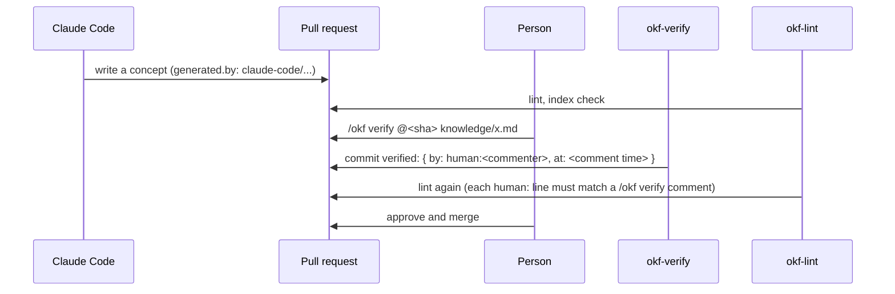

# okf-knowledge

English | [日本語](README.ja.md)

A Claude Code plugin for keeping team knowledge as an [Open Knowledge Format (OKF) v0.2](https://github.com/GoogleCloudPlatform/open-knowledge-format/blob/main/SPEC.md) bundle in a repository: written by agents, verified by people, checked by CI.

OKF stores knowledge as markdown files with YAML frontmatter.
Version 0.2 adds frontmatter for who wrote a concept (`generated`), who checked it (`verified`), whether it is current (`status`), and when it expires (`stale_after`).
This plugin makes those fields mean what they say:

- **Agents write, people verify.** Claude Code records itself in `generated` and never writes a `human:` entry into `verified`. A person verifies by commenting `/okf verify @<sha> <path>` on the pull request; a workflow records it. CI rejects any `human:` entry that does not match such a comment by someone with write access.
- **The spec's open questions are closed by team rules.** OKF v0.2 leaves the base of relative paths and the set of actor forms open, and a date-only `stale_after` silently never expires. `CONVENTIONS.md` pins these down, and lint enforces them.
- **Knowledge goes stale on schedule.** A weekly issue lists stale, deprecated, unverified and changed-since-verification concepts.

## Install

```sh
claude plugin marketplace add kumewata/okf-knowledge
claude plugin install okf-knowledge@okf-knowledge
```

The scripts need [uv](https://docs.astral.sh/uv/) and Python 3.11 or later; they declare their dependency (PyYAML) inline, so there is nothing else to install.

## Set up a repository

Ask Claude Code to "set up an OKF knowledge bundle", or by hand:

1. Copy [`templates/CONVENTIONS.md`](skills/okf-knowledge/templates/CONVENTIONS.md) to `knowledge/CONVENTIONS.md` and adjust it with your team.
2. Create `knowledge/index.md` with `okf_version: "0.2"` in its frontmatter, and generate the rest with [`scripts/index.py`](skills/okf-knowledge/scripts/index.py) (`uv run index.py knowledge`).
3. Copy the three workflows in [`templates/github/`](skills/okf-knowledge/templates/github/) to `.github/workflows/`, and make `okf-lint` a required check.

`knowledge/` is only the default: put the bundle in any directory and change `paths` and `bundle` in the workflows to match.
A repository can hold several bundles, each with its own `CONVENTIONS.md`; add one job per bundle to each workflow, list every bundle directory in okf-lint's `paths`, give each okf-status job its own `label`, and name the paths of one bundle per `/okf verify` comment.

The workflows call this repository's reusable workflows, which check out the scripts at the same commit, so `@v1.0.5` pins both.
Release tags (`v1.0.0`, `v1.0.1`, …) are never moved; a fix ships as a new tag. Do not use the `v1` tag: it points at a pre-release commit with a known bug.

## Protect the default branch

Lint checks what a pull request adds, so it only protects what reaches the default branch through pull requests.
Set up a branch protection rule or ruleset for the default branch:

- **Require a pull request before merging**, so that nobody pushes `human:` entries or convention changes straight to the branch.
- **Require status checks to pass**, and add each okf-lint job. The check is named `<caller job> / lint`, such as `okf-lint / lint` (and `okf-lint-ops / lint` for a second bundle).
- **Require review from Code Owners**, with `CODEOWNERS` entries for each bundle's conventions and for the workflows, so that the rules lint and verify apply cannot change without the owners:

  ```
  /knowledge/CONVENTIONS.md @your-org/knowledge-owners
  /.github/workflows/ @your-org/knowledge-owners
  ```

  A `pull_request` workflow runs as the pull request defines it, so without this a pull request could edit its own okf-lint call (for example, point `bundle` elsewhere) and still pass the required check.
  In an organization, a ruleset that requires the okf-lint workflow itself (rather than its status check) is another way to keep a pull request from replacing it; see GitHub's documentation on requiring workflows with rulesets.

With okf-lint required and no GitHub App, every `/okf verify` also needs a maintainer to approve the lint run on the bot's commit (see below).

## How verification works



Pull request approval is not used as the signal: GitHub does not let authors approve their own pull requests, and an author driving Claude Code is often the person best placed to check its output.
`okf-verify` refuses commenters without write access, a SHA that is not the pull request's head (so a push after the comment cannot be verified unseen), files the pull request did not change, and, when `allow_self_verify` is false, anyone who opened or committed to the pull request.
It does not handle pull requests from forks yet.

Both workflows read `CONVENTIONS.md` from the base branch, so a pull request cannot loosen its own rules.
Lint checks each added `human:` entry against the pull request's comments rather than git author names, which anyone can set.
The verify job holds a write token, so it never runs code from the pull request: the scripts and the pull request are checked out into separate directories, uv ignores project configuration, and the only third-party code it runs is PyYAML, pinned to one version and installed from a hash-checked lock file (`scripts/*.py.lock`).

Without a GitHub App, `okf-verify` pushes with `GITHUB_TOKEN`, and GitHub holds the lint re-run on that commit for a maintainer's approval.
To avoid that, install a GitHub App with `contents: write` and `pull-requests: write` and pass its ID and private key as the secrets `OKF_APP_ID` and `OKF_APP_PRIVATE_KEY` (see the template).

## Scripts

| Script | Purpose |
| --- | --- |
| `lint.py <bundle> [--base <ref>] [--format text\|github]` | Spec conformance and team rules, OKF001–OKF012 |
| `index.py <bundle> [--check]` | Generate or check `index.md` files (§8) |
| `status.py <bundle> [--now <iso>] [--format md\|json] [--link-prefix <url>]` | Concepts that need attention (the conventions file is not listed) |
| `verify.py <bundle> <path>... --by human:<id> --at <iso>` | Append a verification (used by the workflow) |

The rules and every `okf_conventions` key are in [`references/conventions-schema.md`](skills/okf-knowledge/references/conventions-schema.md).

## Out of scope

- Attested Computations (OKF §10). The spec leaves the receipt and verdict formats and the attester interface to a future version.
- Agents other than Claude Code.
- GitHub Enterprise Server: the reusable workflows rely on `job.workflow_repository` and `job.workflow_sha`, which it does not provide.

## Development

```sh
uv run pytest
actionlint
claude plugin validate .
```

The workflows install each script's dependencies from its lock file (`uv run --locked`). After changing a script's `dependencies`, regenerate the lock with `uv lock --script skills/okf-knowledge/scripts/<script>.py`.

The agent's behavior is checked with `claude plugin eval` (cases in `evals/`; each scaffolds a small bundle and grades the files the agent leaves):

```sh
claude plugin eval . --scaffold --ablation none --allow-tools Write Edit Bash
```

The eval sandbox has no network, so `uv run` cannot fetch PyYAML there and the agent cannot run lint; the graders check the files directly.

## License

Apache-2.0. `_okf.py` reads timestamps the same way as the OKF reference implementation (GoogleCloudPlatform/open-knowledge-format, Apache-2.0).
